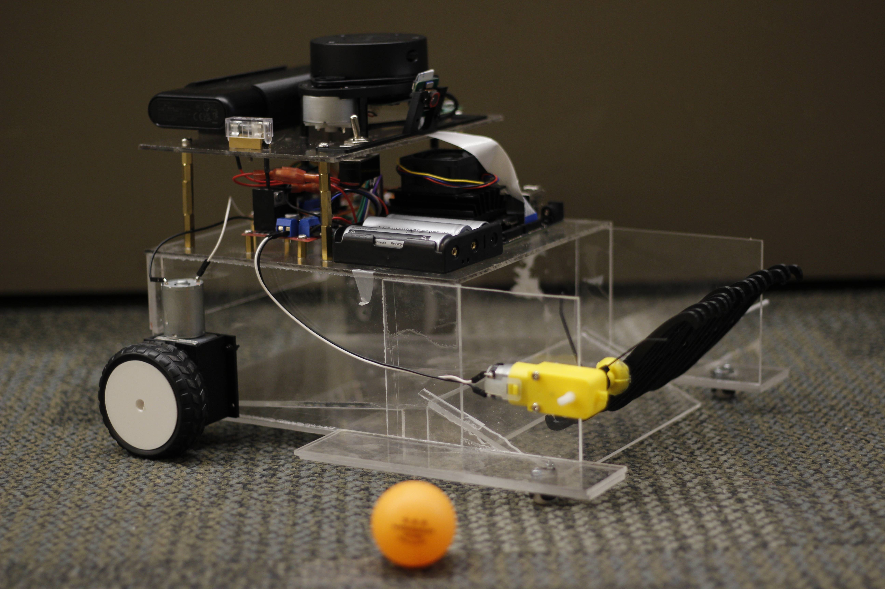

# Autonomous Ping Pong Collector

## Table of Contents
1. [Bot Showcase](#bot-showcase)
2. [Video Demonstration](#video-demonstration)
3. [Introduction](#introduction)
4. [Technical Features](#technical-features)
5. [Performance Metrics](#performance-metrics)
6. [Component List](#component-list)
7. [Future Improvements](#future-improvements)
8. [Conclusion](#conclusion)
9. [Acknowledgements](#acknowledgements)

## Bot Showcase

  
   
  <em>Figure 1: Physical implementation of the autonomous ping pong collector</em>

## Video Demonstration

https://github.com/user-attachments/assets/a1bd56aa-6873-4dc5-8bf9-e565eb9e5ebb

https://github.com/user-attachments/assets/c31f8601-b6fe-43a4-9c8a-2134f7f35e42

https://github.com/user-attachments/assets/c4b83857-8fcc-47f6-a88a-32918e78e0e4

## Introduction

The Autonomous Ping Pong Collector represents an innovative solution to automate the tedious task of retrieving ping pong balls after gameplay sessions. This robotic system combines advanced machine learning techniques with real-time sensor processing to locate and collect orange ping pong balls while autonomously navigating around obstacles in its environment. 

The system was designed to demonstrate how repetitive tasks can be effectively automated using modern computer vision and robotics technologies. By implementing this solution, players can focus entirely on their game without interruptions for ball retrieval, while simultaneously showcasing practical applications of edge computing in robotics.

## Technical Features

The system incorporates several sophisticated technical components working in concert to achieve autonomous operation. The vision system utilizes a MobileNet SSDv2 (Single Shot Detector) architecture paired with an Arducam IMX519 camera module for reliable detection of ping pong balls. This combination provides efficient real-time object detection while maintaining computational efficiency on embedded hardware.

For environmental navigation, the robot employs a RPLIDAR A1M8 scanning LiDAR unit configured for real-time sector analysis. The system implements weighted distance algorithms to evaluate obstacle proximity and trigger dynamic evasion maneuvers. This approach enables smooth navigation through complex environments while maintaining pursuit of target objects.

The software architecture utilizes multithreading to parallelize critical operations, including simultaneous LiDAR obstacle detection, camera-based ball tracking, and continuous autofocus adjustment. This concurrent processing ensures system responsiveness during all operational phases.

Additional computer vision capabilities include real-time color space processing through OpenCV. The system converts camera frames to HSV color space for reliable detection of specific colored regions, such as blue drop-off zones. Through advanced image processing techniques including masking, contour detection, and bounding box visualization, the robot can identify and interact with designated target areas in its environment.

## Performance Metrics

The MobileNet SSDv2 model demonstrates the following performance characteristics:

| Metric | Value |
|--------|-------|
| Precision | [Insert Value] |
| Recall | [Insert Value] |
| F1 Score | [Insert Value] |
| Inference Speed (FPS) | [Insert Value] |
| mAP@0.5 | [Insert Value] |

These metrics were evaluated under [describe testing conditions] and demonstrate the model's effectiveness for the ping pong ball detection task.

## Component List

The system integrates the following hardware components:

| Item | Quantity |
|------|----------|
| NVIDIA Jetson Nano 4GB | 1 |
| SD-Card | 1 |
| Anker Portable Battery (5V/4A) | 1 |
| Arduino Nano | 1 |
| Arducam IMX519 | 1 |
| Slamtec RPLIDAR A1M8 | 1 |
| TT Motor ((3-6v)(150-160 mA)) | 1 |
| DC12V Electric Motor Reversible High Torque Turbo Worm Gear Box Reduction Electric Motor 5/6/20/40 62RPM | 1 |
| L298n Driver 5v (logic)/36ma (logic) | 2 |
| 9g Servo(4.8-6v/100-250mA) | 1 |
| PCA9685 (2.3-5.5/25mA(per servo)) | 1 |
| 3mm Clear Cast Acrylic 3mm 12"x12" | 6 |
| 3mm Clear Cast Acrylic 3mm 12"x24" | 2 |
| 18650 2600 mAh 3.7 Volt Batteries, 2 Pack | 4 |
| 18650 Battery Charger, 4 Slots | 1 |
| 3 Pack 3.1A QC Micro USB Cable | 1 |
| 16 Channel PWM Servo Driver | 1 |
| 5 PCs SG90 Servo Motor Kit | 1 |
| Keeyes L298n and Motor Kit | 1 |
| M3 x 10mm Phillips Screws (10 Pcs) | 1 |
| M3 x 20mm Phillips Screws (10 Pcs) | 1 |
| M3 x 25mm Phillips Screws (10 Pcs) | 1 |
| M3 Machine Hex Nut (10 Pcs) | 2 |
| M2.5 x 6mm Phillips Screws (10 Pcs) | 1 |
| M2.5 x 20mm Phillips Screws (10 Pcs) | 1 |
| M2.5 Machine Hex Nut | 2 |
| Pololu Ball Caster 1/2" Plastic | 2 |
| Pololu Ball Caster Wheel 3/8" Metal | 2 |
| SparkFun 22AWG Red Wire | 1 |
| SparkFun 22AWG Black Wire | 1 |
| 4x 18650 Battery Holder | 1 |
| 2 Oz Applicator Bottle | 5 |
| Weldon 4 1/4 Pint Fast Set | 1 |
| Hitachi Brass Standoff Spaces | 7 |
| 20mm Fuse (2 Pack) – 3 Amp | 1 |
| SPST Toggle Switch | 1 |
| 20mm Fuse Holder | 1 |

## Future Improvements

Several potential enhancements have been identified to improve system performance and reliability. The LiDAR clearance margin could be optimized by implementing dynamic threshold adjustments based on obstacle angle and proximity. This would prevent shallow-angle collisions while maintaining efficient navigation.

The ball collection mechanism presents opportunities for refinement. Potential modifications include adjusting the sweeper arm geometry, implementing flexible collection lips, or exploring alternative collection methods such as vacuum-based systems. These changes would improve first-contact collection success rates.

Hardware upgrades could significantly enhance system capabilities. Migration to a Jetson Orin Nano platform would provide increased computational resources, enabling the use of more sophisticated detection models like YOLOv8 while maintaining real-time performance. This transition would also ensure long-term platform support and compatibility.

Navigation capabilities could be expanded through the integration of additional sensors. Incorporating IMUs and wheel encoders would enable SLAM (Simultaneous Localization and Mapping) functionality, transforming the system from reactive obstacle avoidance to proactive path planning and environmental mapping.

## Conclusion

The Autonomous Ping Pong Collector successfully demonstrates the integration of computer vision, machine learning, and robotic navigation systems to solve a practical problem. While development presented challenges including hardware limitations and mechanical design iterations, the final implementation proves the viability of the concept. The project provides valuable insights into embedded system design, real-time processing constraints, and the practical considerations of robotic automation. Lessons learned from this implementation will inform future robotics projects and contribute to ongoing development of autonomous systems.

## Acknowledgements

  The development team would like to recognize the contributions of:  
  Eugenio D. 
  Jose J. 
  Daniel A. 
  Jacob B.

